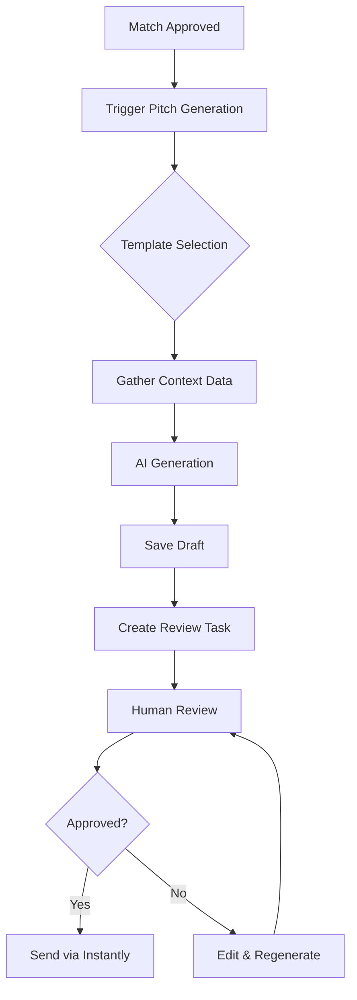

# Pitch System Documentation

This document consolidates all pitch-related documentation for the PGL Podcast Outreach system.

## Overview

The pitch system is a core component that generates personalized outreach emails to podcast hosts. It uses AI to create compelling pitches based on client information, podcast analysis, and match data.

## System Architecture

### Components

1. **Pitch Generation Service** (`services/pitches/generator.py`)
   - Handles the creation of pitch drafts
   - Integrates with AI providers (Gemini, Claude, OpenAI)
   - Uses template system for consistency

2. **Enhanced Pitch Generator** (`services/pitches/enhanced_generator.py`)
   - Advanced version with better personalization
   - Includes episode-specific references
   - Improved subject line generation

3. **Pitch Templates** (`database/queries/pitch_templates.py`)
   - Database-managed templates
   - Support for multiple template types
   - Variable substitution system

4. **API Endpoints** (`api/routers/pitches.py`)
   - POST `/pitches/generations` - Generate new pitch
   - GET `/pitches/generations/{id}` - Retrieve pitch
   - PATCH `/pitches/generations/{id}/content` - Update pitch content
   - POST `/pitches/send` - Send pitch via Instantly

## Workflow

### 1. Pitch Generation Workflow



### 2. Generation Process

1. **Context Gathering**
   - Client profile data
   - Podcast information
   - Recent episodes
   - Match reasoning

2. **Template Application**
   - Select appropriate template
   - Inject variables
   - Apply personalization

3. **AI Enhancement**
   - Generate personalized content
   - Create compelling subject line
   - Add episode-specific references

4. **Quality Checks**
   - Length validation
   - Personalization score
   - Template compliance

## Database Schema

### pitch_generations Table
```sql
- pitch_gen_id (PRIMARY KEY)
- match_id (FOREIGN KEY)
- person_id (FOREIGN KEY)
- draft_text
- template_used
- variables_snapshot (JSONB)
- ai_model_used
- generation_prompt
- created_at
- updated_at
```

### pitches Table
```sql
- pitch_id (PRIMARY KEY)
- pitch_gen_id (FOREIGN KEY)
- campaign_id (FOREIGN KEY)
- person_id (FOREIGN KEY)
- media_id (FOREIGN KEY)
- subject_line
- body_text
- status (draft, sent, replied, etc.)
- sent_at
- created_at
- updated_at
```

## API Usage

### Generate a Pitch

```bash
POST /pitches/generations
Content-Type: application/json

{
  "match_id": 123,
  "template_id": 1,
  "regenerate": false
}
```

### Update Pitch Content

```bash
PATCH /pitches/generations/{id}/content
Content-Type: application/json

{
  "draft_text": "Updated pitch content...",
  "new_subject_line": "New subject line"
}
```

### Send Pitch

```bash
POST /pitches/send
Content-Type: application/json

{
  "pitch_id": 456,
  "send_immediately": true
}
```

## Templates

### Available Templates

1. **Friendly Introduction** (`friendly_intro_template.txt`)
   - Casual, conversational tone
   - References recent episodes
   - Focuses on value proposition

2. **B2B Startup** (`b2b_startup_template.txt`)
   - Professional tone
   - Emphasizes business expertise
   - Data-driven approach

3. **Bold Follow-up** (`bold_followup_template.txt`)
   - Direct approach
   - Used for second outreach
   - Creates urgency

### Template Variables

Common variables available in all templates:

- `{host_name}` - Podcast host's name
- `{podcast_name}` - Name of the podcast
- `{client_name}` - Client's full name
- `{client_bio}` - Generated client biography
- `{recent_episode_topic}` - Recent episode reference
- `{talking_points}` - Key discussion topics
- `{client_expertise}` - Areas of expertise

## Frontend Integration

### Review Interface

The frontend provides a comprehensive pitch review interface:

1. **Draft Display**
   - Formatted pitch preview
   - Subject line editing
   - Character/word count

2. **Editing Tools**
   - Rich text editor
   - Variable highlighting
   - Template switching

3. **Actions**
   - Approve & Send
   - Request Regeneration
   - Manual Edit
   - Save Draft

### API Integration Points

```javascript
// Generate pitch
const response = await fetch('/api/pitches/generations', {
  method: 'POST',
  headers: { 'Content-Type': 'application/json' },
  body: JSON.stringify({ match_id, template_id })
});

// Update pitch
await fetch(`/api/pitches/generations/${id}/content`, {
  method: 'PATCH',
  headers: { 'Content-Type': 'application/json' },
  body: JSON.stringify({ draft_text, new_subject_line })
});
```

## Best Practices

### 1. Personalization
- Always include specific episode references
- Use the host's actual name (not "Host")
- Reference recent content (within 3 months)

### 2. Length Guidelines
- Subject lines: 50-70 characters
- Email body: 150-250 words
- 3-4 paragraphs maximum

### 3. Quality Checks
- No generic greetings
- Specific value propositions
- Clear call-to-action
- Professional but friendly tone

## Monitoring & Analytics

### Metrics Tracked
- Generation success rate
- AI model performance
- Template effectiveness
- Response rates by template
- Edit frequency

### Cost Tracking
- AI usage per generation
- Average cost per pitch
- Model comparison costs

## Troubleshooting

### Common Issues

1. **Generation Failures**
   - Check AI API keys
   - Verify template exists
   - Ensure match data is complete

2. **Sending Failures**
   - Verify Instantly API key
   - Check email validation
   - Ensure pitch is approved

3. **Poor Quality Output**
   - Review template effectiveness
   - Check context data quality
   - Consider model switching

## Future Enhancements

1. **A/B Testing Framework**
   - Multiple template variations
   - Automated performance tracking
   - Winner selection algorithms

2. **Advanced Personalization**
   - Social media integration
   - Sentiment analysis
   - Dynamic content blocks

3. **Automation Improvements**
   - Batch generation
   - Scheduled sending
   - Follow-up sequences

---

For implementation details, see:
- [Frontend Pitch Generation Guide](FRONTEND_PITCH_GENERATION_GUIDE.md)
- [API Documentation](API_DOCUMENTATION.md#pitch-endpoints)